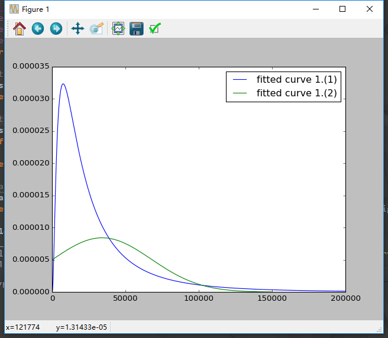

# Pattern Recognition Homework 1

## 吴先 1300012817

### 1.

#### (1)

$p(x)=\frac{1}{\sigma x\sqrt{2\pi}}\exp(-\frac{(\ln x-\theta)^2}{2\sigma^2})$

$\sum^n_{i=1} \ln p(x|\theta, \sigma)=-\sum^n_{i=1}(\ln(\sigma x \sqrt{2\pi})+\frac{(\ln x-\theta)^2}{2\sigma^2})$

$\frac{d\sum^n_{i=1} \ln p(x|\theta, \sigma)}{d\theta}=\frac{1}{\sigma^2}\sum^n_{i=1}(\ln x-\theta)=0$，解得$\hat\theta=\frac{1}{n}\sum^n_{i=1}\ln x$

$\frac{d\sum^n_{i=1} \ln p(x|\theta, \sigma)}{d\sigma}=\sum^n_{i=1}(-\frac{1}{\sigma}+\frac{(\ln x-\theta)^2}{\sigma^3})$，解得$\hat\sigma^2=\frac{1}{n}\sum^n_{i=1}(\ln x -\theta)^2$

```
theta=9.9207620579, sigma=0.994120350836
```

#### (2)

推导过程略

$\hat\theta=\frac{1}{n}\sum^n_{i=1}x$

$\hat\sigma^2=\frac{1}{n}\sum^n_{i=1}(x -\theta)^2$

```
theta=34150.66659, sigma=47345.5740823
```

 