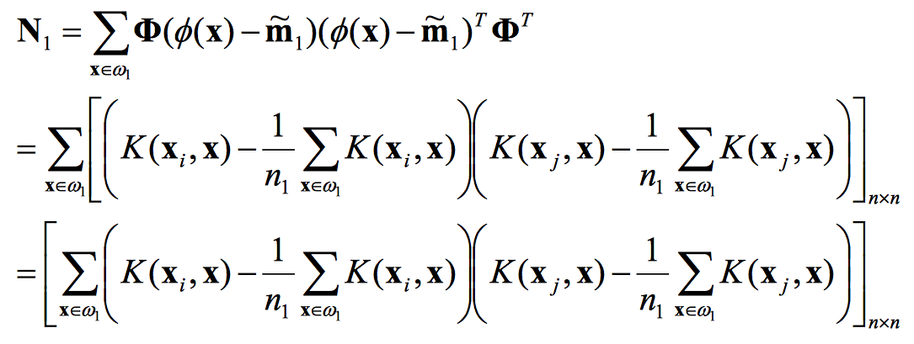
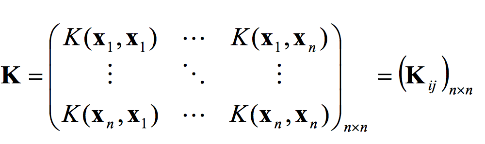
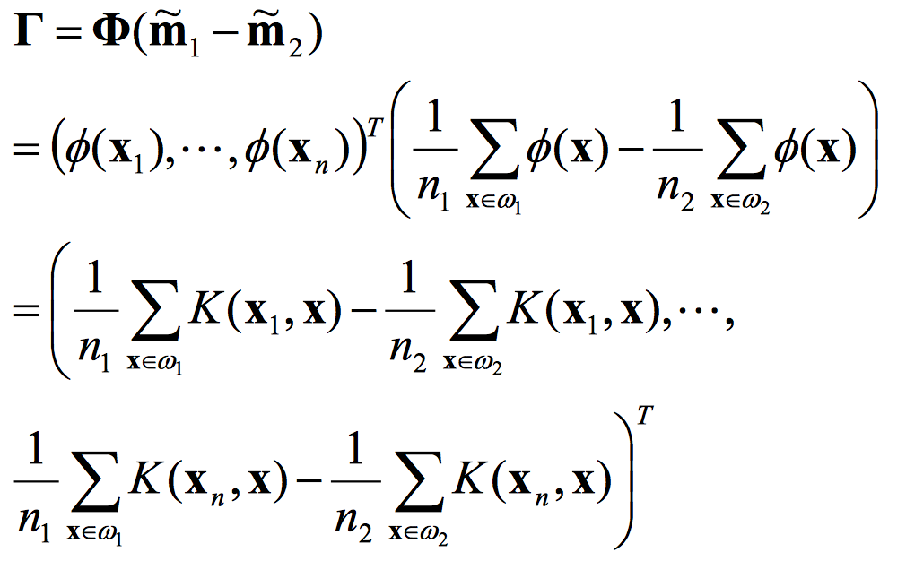
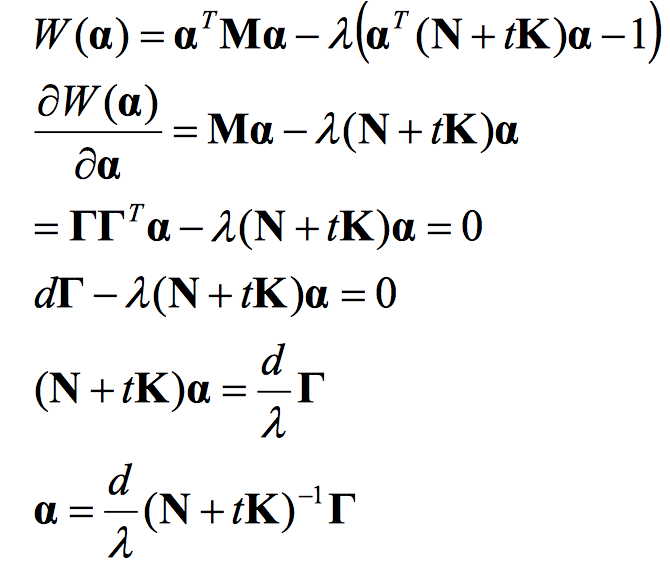
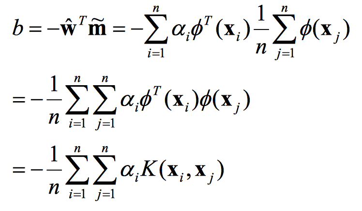
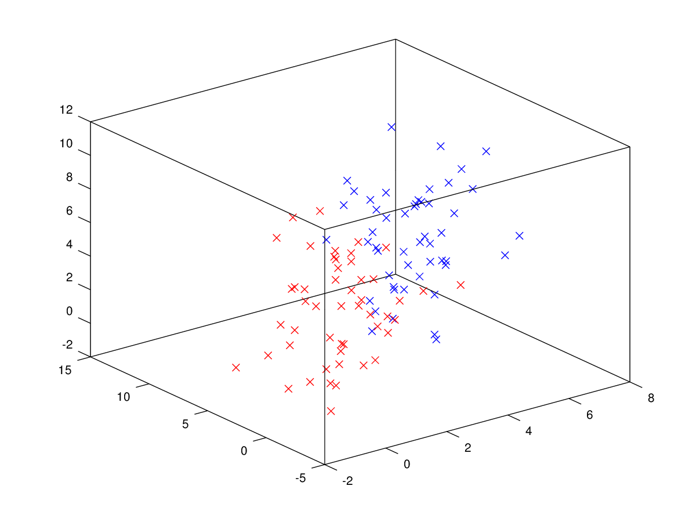

# Pattern Recognition Homework 9

## 吴先 1300012817

### 算法实现

利用下述公式分别计算$N_1, N_2, N, K, \Gamma, \vec\alpha, b$

     

正好最近在备matlab的课，所以在电脑上装了个octave，这次作业就用octave做了。代码如下：

main.m

```matlab
clear; close all; clc;
A = importdata('A.txt');
A1 = A(find(A(:,4)==1),1:3);
A2 = A(find(A(:,4)==0),1:3);
A = A(:,1:3);
figure(1);
plot3(A1(:,1),A1(:,2),A1(:,3),'bx');
hold on;
plot3(A2(:,1),A2(:,2),A2(:,3),'rx');
print -dpng 'data_plot.png';

sigma = 2;
t = 1;

disp('start')
N1 = zeros(100,100);
N2 = zeros(100,100);
m1 = zeros(100,1);
m2 = zeros(100,1);
partial_kernel = @(X1,X2)my_kernel(X1,X2,sigma);
for i=1:100
    for j=1:50
        m1(i) = m1(i) + partial_kernel(A(i,:),A1(j,:));
        m2(i) = m2(i) + partial_kernel(A(i,:),A2(j,:));
    end
    m1(i) = m1(i)/50;
    m2(i) = m2(i)/50;
end
disp('m1, m2 finished');
for i=1:100
    for j=1:100
        for k=1:50
            N1(i,j) = N1(i,j) + (partial_kernel(A(i,:),A1(k)) - m1(i)) * (partial_kernel(A(j,:),A1(k)) - m1(j));
            N2(i,j) = N2(i,j) + (partial_kernel(A(i,:),A2(k)) - m2(i)) * (partial_kernel(A(j,:),A2(k)) - m2(j));
        end
    end
end
disp('N1, N2 finished');

N = N1 + N2;
K = zeros(100,100);
for i=1:100
    for j=1:100
        K(i,j) = partial_kernel(A(i,:),A(j,:));
    end
end
Gamma = m1 - m2;
a = (N + t * K)^-1 * Gamma;
b = -0.5 * sum(a .* (m1 + m2));

save a.txt a -ascii
save b.txt b -ascii
```

my_kernel.m

```matlab
function k = my_kernel(X1, X2, sigma)
    k = exp(-0.5/(sigma.^2)*(norm(X1-X2,2).^2));
end
```

采用了RBF核，选取$t=1, \sigma=2$。

结果保存在了a.txt（alpha）和b.txt（b）中。

### 实现细节

大量消耗时间的代码段为计算$N_1、N_2$的部分，定义了一个```partial_kernel```本来是想利用```bsxfun```来为矩阵运算加速，但是怎么样也写不明白这一部分的代码。 

### 判别函数

```matlab
syms x1 x2 x3 fx;
fx = 0;
for i=1:100
    fx = fx + a(i) * partial_kernel(A(i,:),[x1,x2,x3]);
end
fx = fx + b;
```


