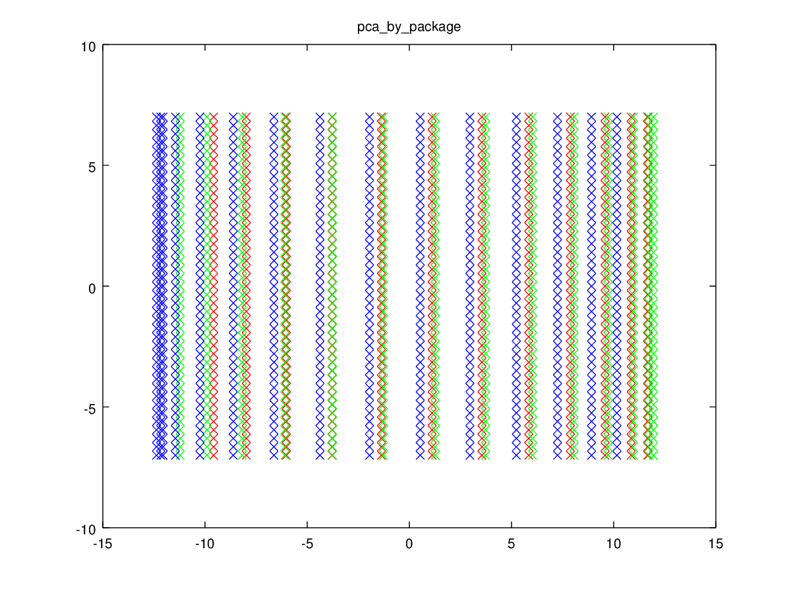

# Pattern Recognition Homework 13

## 吴先 1300012817

### 实验设计

一共做了四幅图像，分别是原始数据的3维散点图；用octave的pca函数（老版本为princomp）函数的pca；用svd实现的pca；lda的二维散点图。

### 算法流程

最初是按照ppt上的算法流程实现的。

但是pca最后投影出的结果与使用软件包自带的pca结果在y舟上有偏移。软件包的结果都是以(0,0)为原点的。经过检查发现软件包都是以去均值化后的结果进行的投影。所以我在后面用svd实现的pca和lda中都使用了去均值化后的向量做投影（33行和52行），而不是原始的数据集。使用原始数据集不会对结果的形状产生影响，只会产生偏移。

    

### 结果分析

pca的结果在维度上更加紧凑。其实不需要两个维度，只使用一个维度即可将数据区分开。但是从线性可分的角度，lda的结果更适用于训练分类器。

这个结果应该不意外，毕竟lda是带有标签信息的，而pca是完全无监督的降维。