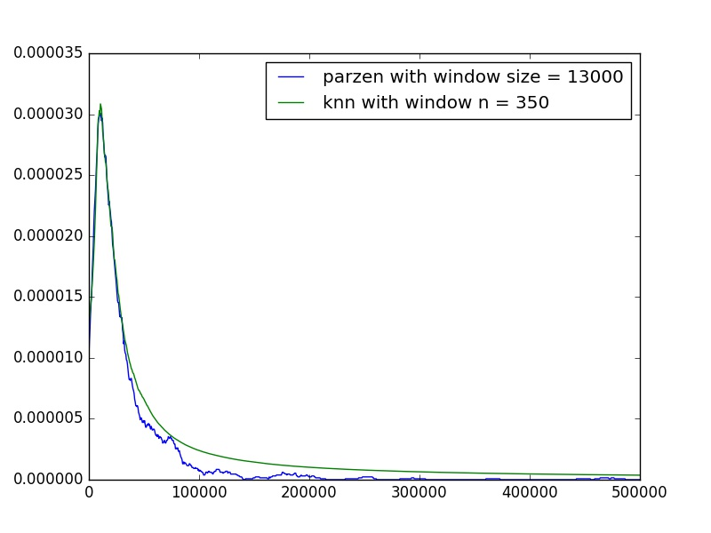

# Pattern Recognition Homework 2

## 吴先 1300012817

### 算法实现

#### (1)

照着课件上的公式直接实现程序就行，感觉没什么好说的。。

Parzen算法一开始我实现的是对于所有采样点，遍历全部数据点来计数在窗口内的点，后来想着还是优化一下速度吧，所以现在的版本使用的是将所有数据点排序之后，二分查找来找到窗口上界和窗口下界的点的序号（排序后），作差得到的窗口内点的数目。

然而1000个点并没有太多时间上的差异（也可能python就是慢）。

#### (2)

依然是照着课件上的公式实现。

然而没想清楚怎么快速找到包含K个数据点的最小窗口大小，所以只实现的是先计算所有数据点到采样点的距离，排序后取第K大的距离作为半窗口长，乘2后得到窗口大小。

同样，1000个点实际上没什么时间差异。

### 寻找合适的参数

窗口大小和K的取值应该是这两个方法的超参数了吧。

没有使用什么统计量来评估超参数的好坏，暴力地按照一定步长输出了一定范围内的结果，肉眼查看效果好坏（详情见parzen_plot/和knn_plot/）。可以看出随着窗口大小的增加（或是K的取值的增加），概率分布函数上的跳动越来越小，也即整条曲线越来越平滑，从类似于直方图的折线直至平滑成一条直线。

下面是选定的窗口大小和K的取值，以及二者绘制在同一张图上的结果。 

knn在观测点比较稀疏的部分更为平滑一点，parzen则刻画得更细致。

 

 