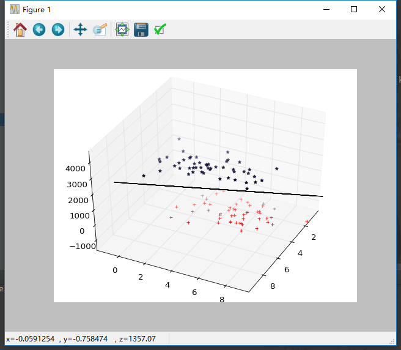

# Pattern Recognition Homework 3

## 吴先 1300012817

### 算法实现

#### (1) Fisher

依然是照着课件上的公式实现。

$\vec w=(S_0 + S_1)^{-1}(m_0-m_1)$

需要注意的是要区分好matlab（也包括python的numpy库）中对于普通的一维列表和一个1*n维向量的差异，一个是[1.0, 2.0, 3.0]，另一个是[[1.0, 2.0, 3.0]]。

$\vec w = [ -4.95219720e-02, -1.47476421e-02, 9.09391755e-05]$

$b=0.20663946$

#### (2) MSE

$\vec w=\frac{n_0n_1}{n}(t_0-t_1)S_t^{-1}(m_0-m_1)$

实现的时候不需要考虑$t_1$和$t_2$的值，因为$\vec w$只是方向，所以这个scale不会影响结果。

图片上截取的是平行于分类面的视角，用于表现两类样本点都分布在分类面的两侧。所以分类面看上去像一条直线。matplotlib画出来的三维图像丑的不行。

0.20663946

$\vec w = [-1.2380493, -0.36869105, 0.00227348]$

$b=5.16598644$

 