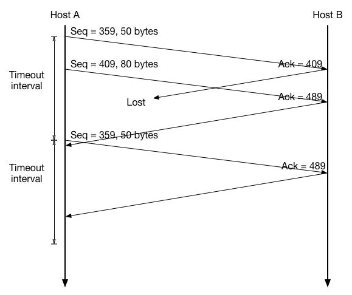

# 2016.ComNet.2nd.Assignment
吴先 1300012817

---

## R2.

1. For a sender, he should give the delegate the letter, the address of the destination house, and the name who is supposed to receive the letter. Then, the delegate writes the receiver's name on the top of the letter, puts the letter into the envelope and writes the address on the envelope. Finally the delegate gives the envelope to the mail service.
     For a receiver, firstly the delegate receives the envelope from the mail service. Then he opens the envelope and check the name of the receiver on the top of the letter. Finally he gives the letter to the receiver.

2. No. The mail service is only supposed to send the envelopte to correct house, which only requires the information on the envelope.

## R14.

1. 20 bytes.
2. ack number should be 90.

## P24. 

1. The sequence number is 409, source port number is 1028, destination port number is 80.
2. The ack number is 409, source port number is 80, destination port number is 1028.
3. The ack number is 439.
4. 

## P34.

1. From 1 to 6 and from 23 to 26.
2. From 6 to 16 and from 17 to 22. (Just according to the plot.)
3. By a triple duplicate ACK. Because the window size didn't drop to 1.
4. By a timout. Because the windows size dropped to 1.
5. The initial value of  $Threshold$ at the first transmission round is 32. Because the slow start stops at the window size of 32.
6. The value of $Threshold$ at the 18th transmsiion round is 21. Because when a packet loss is detected, the $Threshold$ is set to half of the window size.
7. The value of $Threshold$ at the 24th transmsiion round is 14. The same as 6..
8. During the 7th transmission round. The segment sequence is as followed: 1, 2-3, 4-7, 8-15, 16-31, 32-63, 64-96.
9. The value of $Threshold$ is 4. The same as 6..
   The value of window size is 7. Because it is set to be $Threshold + 1$

## P36.

1. It takes 7 RTTs. In AIMD, $CongWin$ increases by 1 in every RTT that has no loss. So it takes $(8MSS - 1MSS)\div 1MSS/RTT = 7 RTT$
2. The average throughout should be 4 RTTs. $\sum_{i=1}^7iMSS\div 7RTT=4MSS/RTT$